# Monitoring tools to track metrics and critical situations 
#### [vagrant / swarm / micrometer / prometheus / loki / grafana / blackbox_exporter / cAdvisor]
## Part 1. Getting metrics and logs
#### deploying services from previous project:
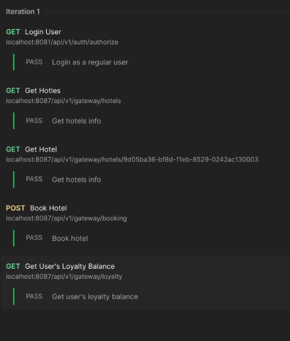
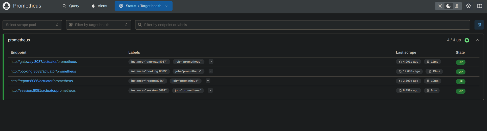
#### Use the Micrometer library to write the following application metrics collectors:
* Step 1: Add Micrometer Dependency
First, make sure we have the Micrometer dependency in pom.xml 
Maven:
<dependency>
    <groupId>io.micrometer</groupId>
    <artifactId>micrometer-registry-prometheus</artifactId>
    <version>1.9.0</version>
</dependency>

* Step 2: Configure Metrics in Application
In Spring Boot application, we need to set up the metrics registry. Here's how we can do it:


`import io.micrometer.core.instrument.Counter;`  
`import io.micrometer.core.instrument.MeterRegistry;`  
`import org.springframework.beans.factory.annotation.Autowired;`  
`import org.springframework.stereotype.Component;`

``` 
@Component 
public class MetricsCollector {

    private final Counter messagesSent;
    private final Counter messagesProcessed;
    private final Counter bookings;
    private final Counter requestsReceived;
    private final Counter authRequests;

    @Autowired
    public MetricsCollector(MeterRegistry registry) {
        this.messagesSent = registry.counter("rabbitmq.messages.sent");
        this.messagesProcessed = registry.counter("rabbitmq.messages.processed");
        this.bookings = registry.counter("bookings.total");
        this.requestsReceived = registry.counter("gateway.requests.received");
        this.authRequests = registry.counter("auth.requests.received");
    }

    // Methods to increment counters
    public void incrementMessagesSent() {
        messagesSent.increment();
    }

    public void incrementMessagesProcessed() {
        messagesProcessed.increment();
    }

    public void incrementBookings() {
        bookings.increment();
    }

    public void incrementRequestReceived() {
        requestsReceived.increment();
    }

    public void incrementAuthRequest() {
        authRequests.increment();
    }
}
```

* Step 3: Use the Metrics Collector
Now, wherever in our application we perform these actions, we can call these methods to increment the counters. 
First we create a class variable inside every service: 
```
@Autowired
private MetricsCollector metricsCollector;
```

- For RabbitMQ Message Sent: \
`metricsCollector.incrementMessagesSent(); `
in booking-service/src/main/java/com/s21/devops/sample/bookingservice/Statistics/QueueProducer.java

- For RabbitMQ Message Processed: 

`metricsCollector.incrementMessagesProcessed();`
in report-service/src/main/java/com/s21/devops/sample/reportservice/Statistics/QueueConsumer.java


- For Bookings:

`metricsCollector.incrementBookings();`
in booking-service/src/main/java/com/s21/devops/sample/bookingservice/Service/BookingServiceImplementation.java


- For Gateway Requests:

`metricsCollector.incrementRequestReceived();` 
in gateway-service/src/main/java/com/s21/devops/sample/gatewayservice/Controller/GatewayController.java 


- For User Authorization Requests:

`metricsCollector.incrementAuthRequest();`
session-service/src/main/java/com/s21/devops/sample/sessionservice/Service/SessionServiceImplementation.java


* Step 4: Expose Metrics
Ensure that Spring Boot application exposes these metrics. By default, if we include micrometer-registry-prometheus, Spring Boot will automatically configure an endpoint for Prometheus to scrape metrics:


In application.properties or application.yml: \
`management.endpoints.web.exposure.include=*`   
`management.endpoint.prometheus.enabled=true`  

This setup will expose our metrics at /actuator/prometheus. 

Ensure that our Metrics implementation works:
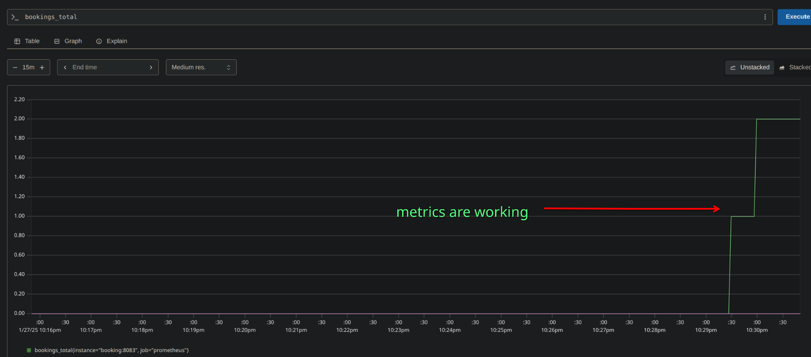
Postman tests were started 2 times so there are 2 bookings. 


#### Add application logs using Loki.
* Using loki and promtail(promtail-config.yml) to collect logs from docker containers
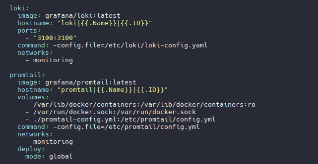

#### Create a new stack for the docker swarm of services with Prometheus Server, Loki, node_exporter, blackbox_exporter, cAdvisor. Check receiving metrics on port 9090 via a browser.
* Adding new docker-compose file, creating external network for 2 stack to communicate with each other
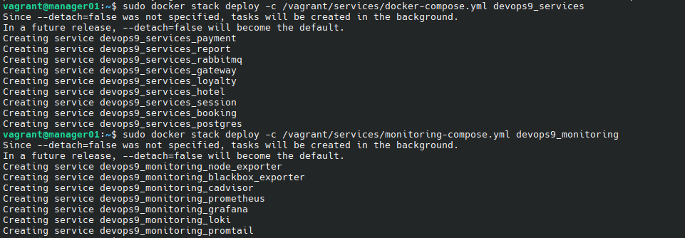
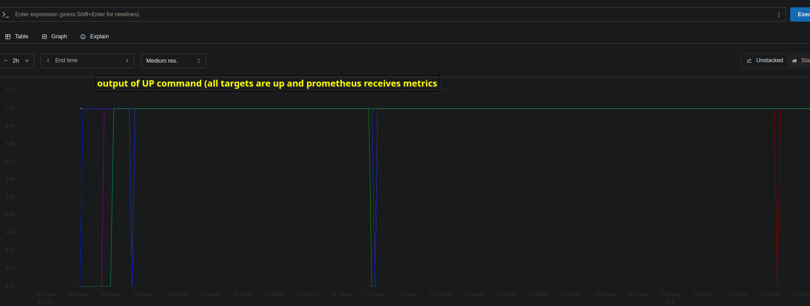
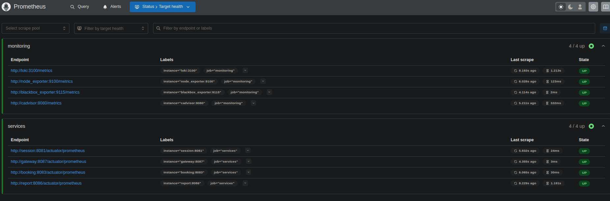

## Part 2. Visualization
* Deploy grafana as a new service in the monitoring stack. We just adding new docker service with volume(to store dashboards)
* Adding new data sources in grafana: data source->add data source->prometheus, loki

* Adding a dashboard with the following metrics to grafana:

number of nodes; \ 
number of containers; \ 
number of stacks; \ 
CPU usage for services; \
CPU usage for cores and nodes; \
spent RAM; \
available and used memory; \
number of CPUs; \
google.com availability; \
number of messages sent to rabbitmq; \
number of messages processed in rabbitmq; \
number of bookings; \
number of requests received at the gateway; \
number of user authorization requests received; \
application logs.
* Using PromQL to write queres + our metrics counters from part 1. Some used node exporter dashboards.
some info about promQL: https://www.dmosk.ru/miniinstruktions.php?mini=prometheus-stack-docker
Our dashboard: \
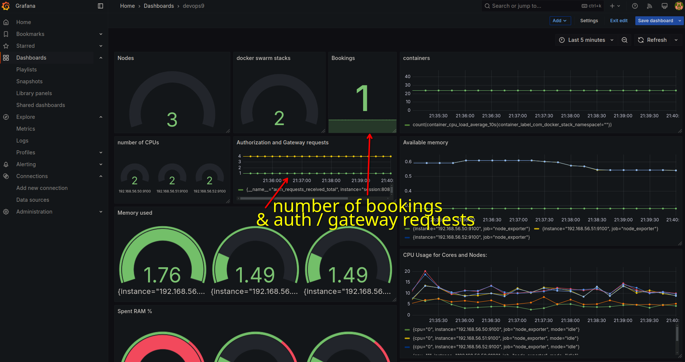
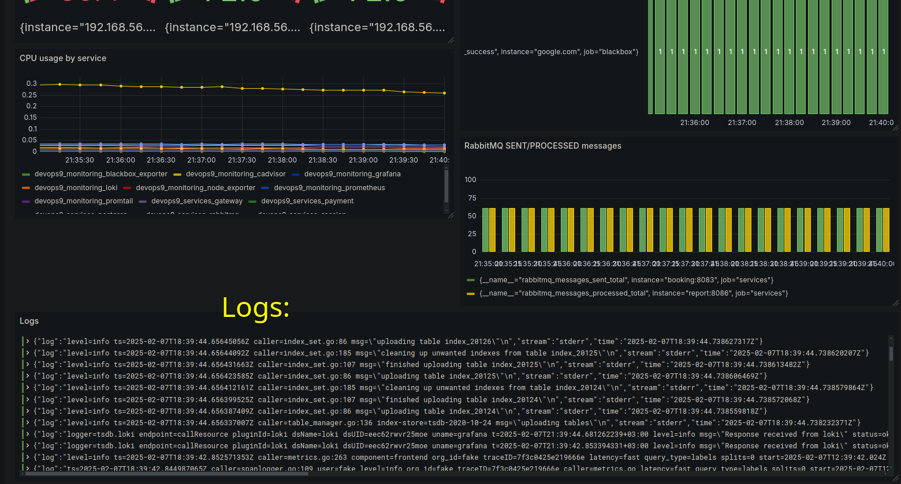

## Part 3. Critical event monitoring
* Deploying alert manager as a new service in the monitored stack.
* creating alertmanager config with email and telegram chat as receivers of our alerts
* creating alerts.yml with alerts rules and messages. Adding rules to prometheus config.

* Adding the following critical events: \
available memory is less than 100 mb; \
spent RAM is more than 1gb; \
CPU usage for the service exceeds 10%.
* Configure notifications via personal email and Telegram. Using Telegram API and email SMTP
Alerts are working: \
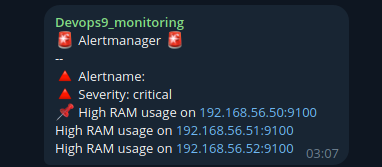
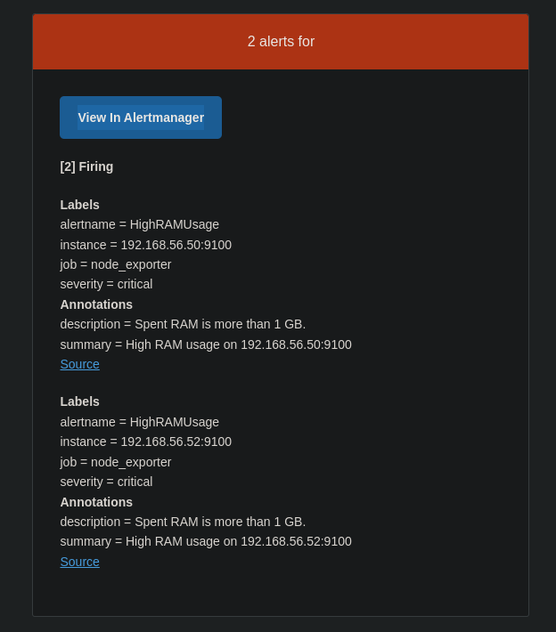
